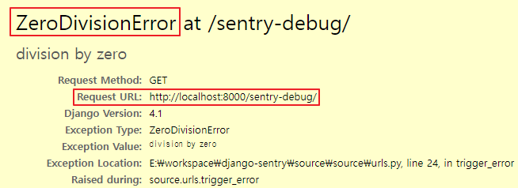
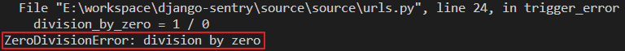
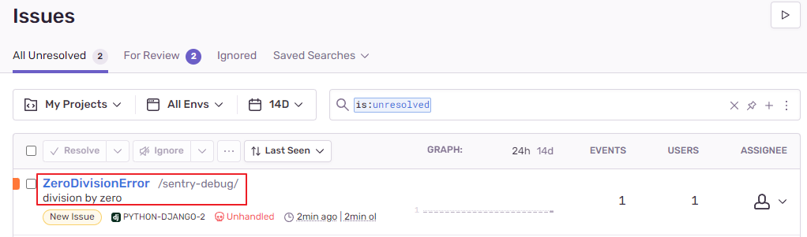

# Django Sentry

Sentry는 애플리케이션의 에러나 예외가 자동적으로 보고되는 라이브러리 입니다.
- 평가판 14일 무료


---

## Tech/Framework

- python 3.9.12
- Django 4.1
- sentry-sdk 1.9.7


---

## 라이브러리 설치

```bash
pip install --upgrade sentry-sdk
```


---

## django setup

```
pip install django
django-admin startproject source
```


---

## sentry 설정 

django 설정파일에서 sentry 설정
- dsn은 [Sentry](https://sentry.io/) 사이트 가입후 Django로 프로젝트 생성하여 `dsn`을 발급받습니다.

source/source/settings.py

```python
import sentry_sdk
from sentry_sdk.integrations.django import DjangoIntegration

sentry_sdk.init(
    # dsn="https://example-org/example-project",
    dsn="https://67f6d242f73046a4a2db8c6330501aad@o1388011.ingest.sentry.io/6709948",
    integrations=[DjangoIntegration()],
    
    # Set traces_sample_rate to 1.0 to capture 100%
    # of transactions for performance monitoring.
    # We recommend adjusting this value in production,
    traces_sample_rate=1.0,

    # If you wish to associate users to errors (assuming you are using
    # django.contrib.auth) you may enable sending PII data.
    send_default_pii=True,

    # By default the SDK will try to use the SENTRY_RELEASE
    # environment variable, or infer a git commit
    # SHA as release, however you may want to set
    # something more human-readable.
    # release="myapp@1.0.0",
)
```


---

## 테스트 기능 추가

source/source/urls.py

```python
...

def trigger_error(request):
    division_by_zero = 1 / 0

urlpatterns += [
    path('sentry-debug/', trigger_error),
]
```


---

## 서버 실행

```bash
cd source
py manage.py migrate
py manage.py runserver
```


---

## Sentry 동작 테스트

### 서버 접속

웹브라우저에서 아래의 경로로 접속

```
http://localhost:8000/sentry-debug/
```

### 에러 발생 확인

1. 브라우저 화면
    
2. 서버 에러
    
3. Sentey 사이트 에러 알림
    
4. Sentey 에러 정보
    


---

## 참고사이트

- [Sentry](https://sentry.io/)
- [Sentry Docs Django](https://docs.sentry.io/platforms/python/guides/django/)
